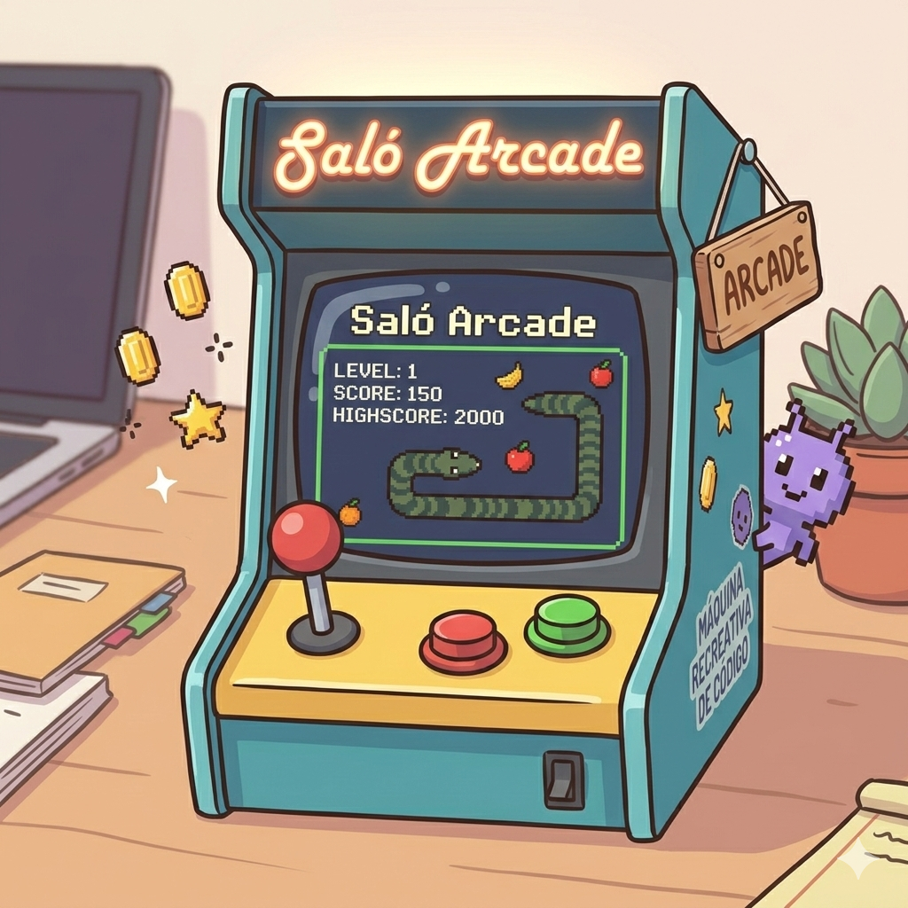

    

<h1 align="center">Saló Arcade by Joel</h1>

## Descripció

Saló Arcade és una senzilla aplicació de videojocs. S'inspira en els salons recreatius on passàvem les tardes quan érem petits i voliem competir perquè el nostre nom aparegués tant amunt al rànquing com ens fos possible.
Mica en mica aquí hi podreu trobar jocs de memòria, tauler i habilitat. Espero que ho pugueu gaudir molt!

## Stack

- TypeScript
- Angular 18 (Standalone)
- SCSS

## Estat actual

Implementat el model de dades, visualització dels elements i funcionalitat de cerca.
